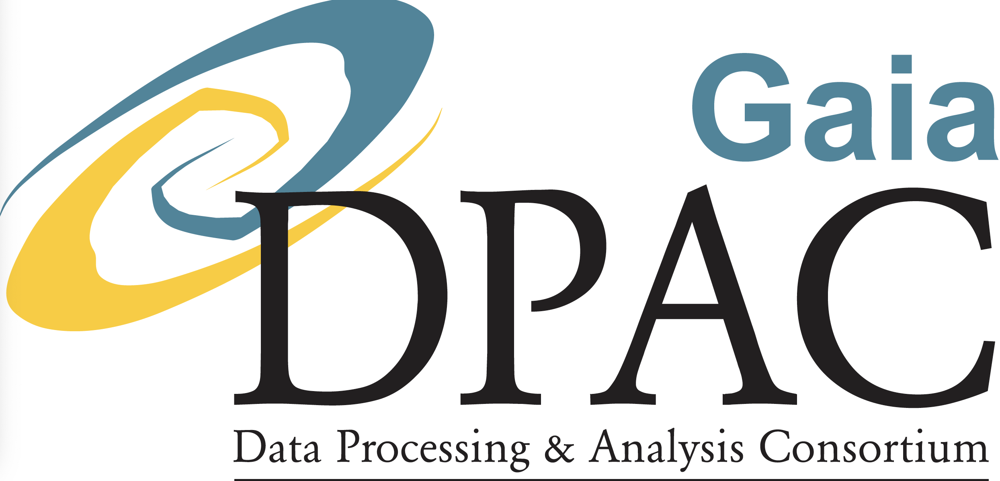

```{=html}
<!--

Explanation of the above params section.
These parameters are set and can be overriden via the command line if knitting via VariDashboard or terminal.
Except runName, all parameters are required.

Change dbUser to your DB user when running editing this file in RStudio.

-->
```
```{=html}
<style>
    body .main-container {
        max-width: 80%;
        margin-left: auto;
        margin-right: auto;
}

h1, .h1, h2, .h2, h3, .h3 {
    margin-top: 84px;
}

</style>
```
```{r setup, echo=FALSE, cache=FALSE, message=FALSE}
# load helper DPCG package
require(dpcgR)

require(dplyr)
require(glue)
require(bit64)
require(tibble)
require(plotly)
require(viridis)
require(RColorBrewer)

options(width = 1600)
options(warn = 0, cache=TRUE, autodep=TRUE, scipen = 999)

# Connect to DB then set the default connection for r-notebook chunks so we do not have to provide it every time with {sql connection = conn}
conn<-dpcgR::connect(hostname=params$hostname,port=params$dbPort, user = params$dbUser)

# connection to be used by the sql chunks, default size of the plots
knitr::opts_chunk$set(connection = "conn", fig.height=10, fig.width=12, 
                      cache=FALSE,
                      autodep=TRUE,  
                      error = TRUE, # do not interrupt in case of errors
                      dev = "ragg_png",
                      class.source = 'fold-show'
                      )

```
___
<center>
{width=50%}


___

<font size=20 color="BLUE">`r rmarkdown::metadata$title` </font>

___

</center>

<font size=10>

|              |              |
|------------- | -------------|
|Prepared by:  | `r rmarkdown::metadata$author`|
|Approved by:  | Laurent Eyer |
|reference:    | GAIA-DG-TN-GEN-KN-013|
|issue:        | 01|
|revision:     | 1|
|date:         | `r Sys.Date()`|
|status:       | Draft |
</font>

---

# Document History

<font size=9>

|Issue  | Revision | Date        | Author   | Comment         |
|------ | ---------| ----------- |--------- |-----------------|
|D      |       1  | 2022-01-10  |KN        | Initial version |
|D      |       2  | 2022-01-31  |KN        | PLJava ts operators added |

</font>

---

# Introduction.

This is collection of SQL queries that DPCG endorses and will maintain their usability as long as possible. 
This notebook with all queries below are also part of Continuous Integration efforts that DPCG will treat as any other software project.

Queries below are self-contained.
They show all aspects of the system usage, from input to results, validation, visualisation.


# Derived Timeseries 


In order to get derived timeseries for a selection of sourceids, runid and operator name we can:

```{sql sql_ts_der_1}
select (dr3_ops_cs36.op_test1(sourceid,'RemoveOutliersFaintAndBrightOperator_FOV_G')).* from
(select  sourceid from dr3_ops_cs36_mv.v_final_dr3_export_helper  limit 5) ;
```

The function takes run configuration, caches it for the session and executes VariFrameowrk pipeline in plJava VM.


# Sampling 
## Sample from a single table

Using **_tablesample_** SQL keyword we scan pages of the tables obtaining quasi-random sampling. 
Keep in mind **_tablesample_** is always applied **before** the where or join clauses.

From our source table
```{sql sample_1}
-- calculate required percentage based on the input set size.
-- select round((10^6*100)/(size),4) perc from catalog where fname = 'GAIA_DR3_ALL'
-- 0.0392 for 1M sample

select 
  sourceid, r_fluxtoMagVal(gfluxmean,getzeropoint('Gaia','GAIA_PHOT_G')) -- convert to mag using R function
from source tablesample bernoulli(0.0392)
limit 10^6

```
	
takes 3 secs, but is quasi-random.

Calculated G Mag on the fly using plR function:

```{sql sample, output.var="result"}
select sourceid, r_fluxtoMagVal(gfluxmean,getzeropoint('Gaia','GAIA_PHOT_G')) g_mag -- convert to mag
from source tablesample system(0.0392)
limit 10^2
```

This is much slower, but might statistically more sound, related to the sampling method (Bernoulli) :

```{sql sample_2, output.var="result"}
 select sourceid, r_fluxtoMagVal(gfluxmean,getzeropoint('Gaia','GAIA_PHOT_G'))  g_mag -- convert to mag
from source tablesample bernoulli(0.0392)
limit 10^2
```

Both methods are very IO intensive.


# Spectra handling

In order to fetch BP/RP spectra for a single source execute:

```{sql spectra_single_source}
select
sourceid,
alpha, alphastarerror, delta, deltaerror, varpi, varpierror, mualphastar, mualphastarerror, mudelta, mudeltaerror, radialvelocity, radialvelocityerror,
  r_pseudo_wavelength(
 (bprp).bprefalpos
  ,500,30) as pseudo_wavelength
 ,(bprp).bpspectralshape
 ,(bprp).bpobstime
from dr3_ops_cs36.tsspectra
join source using (sourceid)
join lateral (select  getspectra(spec) bprp) bprp  on true
where
 catalogid = getmaincatalog()
and sourceid = 2926825431170093184

```

Currently we do not support multidimensional sets of spectra returned: the function returns unnested spectra already, that might need ordering if more sources are involved.